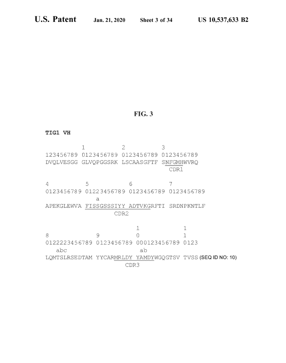

# 📄 Azure Document Intelligence PDF Processing – Project Summary

This document outlines the entire pipeline used for analyzing a PDF using **Azure Document Intelligence (F0 Tier)**, with custom logic to extract and convert data into a searchable and formatted **HTML representation**.

---

## 📌 1. Splitting the PDF into 2-Page Chunks

Since the **Azure Document Intelligence F0 tier** supports **a maximum of 2 pages per request**, we preprocess the original PDF by splitting it into multiple 2-page chunks using **PyMuPDF (fitz)**.

### Code Logic

```python
chunk_size = 2
doc = fitz.open(pdf_path)
total_pages = len(doc)

for i in range(0, total_pages, chunk_size):
    chunk_path = os.path.join(output_dir, f"chunk_{i//chunk_size + 1}.pdf")
    
    chunk_doc = fitz.open()
    for j in range(i, min(i + chunk_size, total_pages)):
        chunk_doc.insert_pdf(doc, from_page=j, to_page=j)
    chunk_doc.save(chunk_path)
```


| Method / Library        | Description                                                         |
| ----------------------- | ---------------------------------------------- | 
| **PyMuPDF (fitz)**      | Fast, lightweight, efficient even on large PDFs, has a lot more functions                                                 |
| PyPDF2 / pypdf          | Pure Python PDF reader/writer, Easy to use, efficient on small PDFs                             |


---


## 📌 2. Posting Request & Receiving Output

To analyze a PDF document using Azure Document Intelligence, we use the `DocumentIntelligenceClient` with the `begin_analyze_document()` method. Since we're on the **F0 (free) tier**, we batch-process the PDF in **2-page chunks**, and analyze each chunk individually.

### 🔧 Features Used:
- `DocumentAnalysisFeature.BARCODES`: Enables barcode detection
- `AnalyzeOutputOption.FIGURES`: Requests figure image extraction

The response from Azure includes structured layout information and raw figure images, and is stored locally as a JSON file for later processing.

```python
poller = document_intelligence_client.begin_analyze_document(
    model_id=model_id,
    body=AnalyzeDocumentRequest(bytes_source=f.read()),
    features=[DocumentAnalysisFeature.BARCODES],
    output=[AnalyzeOutputOption.FIGURES],
)
result = poller.result()

with open(output_json_path, "w") as f:
    json.dump({"analyzeResult": result.as_dict()}, f, indent=2)
```

---

## 📌 3. JSON Output Analysis

### 🔍 Key Sections in JSON:

| Field        | Description |
|--------------|-------------|
| `pages`      | Per-page structure, including words, lines, barcodes |
| `paragraphs` | Logical groupings of content |
| `figures`    | Locations of images |
| `barcodes`   | Decoded barcode values and their polygon positions |
| `tables`     | Structured table data (if any) |

---

## 📌 4. Extracting Figures

Figures are referenced by an id in the result.figures list. The actual images for each figure can be downloaded using get_analyze_result_figure().

```python
response = document_intelligence_client.get_analyze_result_figure(
    model_id=result.model_id,
    result_id=operation_id,
    figure_id=figure.id
)
```
The images are saved to the output directory using a naming convention like page.Fig_index.png, where page is offset by the chunk index and index is the order within the page.

---

## 📌 5. Extracting Barcodes

Each barcode detected by Azure contains:

- Value (e.g., US00D879824S)

- Kind (e.g., Code39)

- A polygon representing the bounding region on the page

To extract the barcode image:

- We render the PDF page using fitz (PyMuPDF) at a high resolution (dpi=300)

- The polygon coordinates are scaled to the image size

- The region is cropped using PIL and saved as a .png

```python
crop_from_pdf(
    pdf_path=pdf_path,
    page_number=page_num,
    polygon=barcode.polygon,
    output_path=fig_path,
    image_name=image_name,
    page_width=page.width,
    page_height=page.height
)
```


### Barcode Cropping
| Method                    | Description                                          |
| ------------------------- | ---------------------------------------------------- 
| **PyMuPDF (fitz) + PIL**  | Render page as image, then crop via bounding polygon 
---

## 📌 6. Setting Offsets (Counters)

After each chunk is processed by Azure, its result JSON contains relative indexes (e.g., paragraph 0, page 1). To combine all chunks into a single cohesive result, we adjust the offsets for:

- pages
- paragraphs
- tables
- figures

```python
# Running counters
para_offset = 0
table_offset = 0
figure_offset = 0
page_offset = 0
```

This enables us to build a merged structure:

```python
merged_result = {
    "pages": [],
    "tables": [],
    "paragraphs": [],
    "sections": [],
    "figures": []
}
```
Each chunk's fields are added to merged_result after applying the appropriate offset transformation.

✅ Why this matters: Azure's layout model returns indices relative to the chunk. Without offsetting, we'd overwrite or mix content between different chunks.


---

## 📌 7. Converting JSON Output to Structured HTML

The final step in the pipeline involves converting the analyzed Azure JSON output into a **positionally accurate and visually styled HTML document**. This is done using a custom `layout_to_html()` function, which:

- Reads the Azure JSON output
- Organizes elements by page
- Calculates styles based on polygon coordinates
- Injects styled HTML for paragraphs, barcodes, figures, and more

### Key Structural Elements

#### 🔹 Pages
Each page is rendered as a `<div class="page">` container with fixed dimensions:
```css
.page {
  width: 850px;
  height: 1100px;
  position: relative;
}
```

#### 🔹 Paragraphs
Paragraphs are rendered using polygon-based positioning:

- Role-based styling (title, header, sectionheaders, footnotes) adjusts font and color. 
- Special markers like :barcode:, :figures: are removed or skipped.

```html
<div class="block heading" style="...">Section 1.1 Introduction</div>
```

#### 🔹 Figures
Each figure is rendered using:

- bounding polygon and page dimensions to calculate exact position.
- Image files must exist in the figure_image_dir to be referenced accordingly.

```html
<div class="figure" style="...">
  
</div>
```

#### 🔹 Barcodes
Barcodes include:

- The cropped barcode image
- The decoded barcode value rendered just below the image using a shifted polygon

```html
<div class="barcode" style="...">
  
</div>
<div class="barcode-text" style="...">US00D879824S</div>
```

#### 🔧 Styling Logic
Bounding boxes (polygon) are converted into CSS left, top, width, and height by the compute_style() function:

```python
scale_x = 850 / page_width
scale_y = 1100 / page_height
left = x * scale_x
top = y * scale_y
```
This ensures that content is rendered in its true position relative to the original document.

### 📦 Output
All the HTML parts are collected into html_parts and written to a final output file:

```python
with open(output_html, "w") as f:
    f.write("\n".join(html_parts))
```

---

## 📌 8. Azure Document Intelligence Performance – Good, Bad, and Ugly

This section highlights scenarios where Azure Document Intelligence performed well, struggled, or failed entirely — based on real-world observations from analyzing various document layouts.

---

### **Good: Clean Layouts with Clear Separation**

Azure performed well when:
- The page had a clear visual hierarchy (titles, paragraphs, figures)
- Images were well-contrasted and unshaded
- OCR text was isolated and not embedded within dense graphics

**Example:**

<div style="display: flex; gap: 10px;">
  
  
</div>

---

### **Bad: Crowded Pages with Mixed Content**

Performance degraded when:
- There were **too many figures or barcodes** on the same page
- Figures contained **dense text or equations inside graphics**
- Images were **light-shaded or low contrast**
- Mixed content (paragaphs + line-numbering) caused confusion

**Issues observed:**
- Paragraphs overlapping
- Incorrect role assignments (e.g., headings as body text)
- Ignored specific figure extraction

**Example:**

<div style="display: flex; gap: 10px;">
  
  
  
  
</div>

---

<div style="display: flex; gap: 10px;">
  
  
  
  
</div>

---


### Summary Table

| Condition                     | Performance | Notes                                                   |
|-------------------------------|-------------|----------------------------------------------------------|
| Clean page, clear layout      | ✅ Good     | Accurate roles and layout parsing                        |
| Floating/random characters  | ❌ Bad     | Some overlaps and misclassification                      |
| Light-shaded images           | ❌ Ugly     | Often ignored                             |
| Text embedded in figures/images      | ❌ Ugly     | Figure confusion                       |

---

